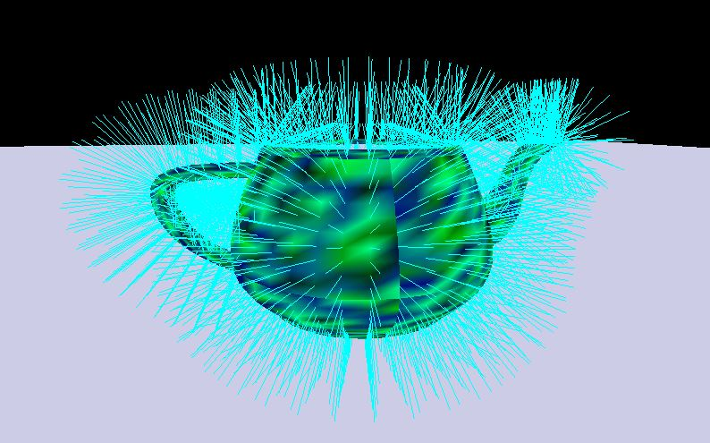
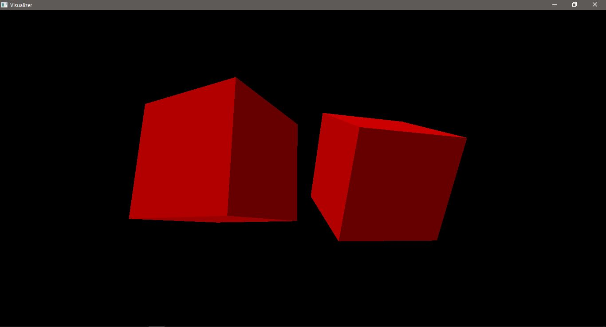

# Opengl-GLSL-Sandbox-Renderer
A little sandbox renderer for learning modern Opengl and GLSL.

Bits added so far:
-Qt window
-Vertex buffers
-Index buffers
-Vertex shader
-Fragment shader
-Camera class
-Qt mouse event
-Qt key press event

Note: I've added all the dependencies because I think it is much easier for a beginner to just clone and run it directly. Right now dependencies are built in Windows only.

Added debug normals in iconic C.G. utah teapot:

First premitive shape:

